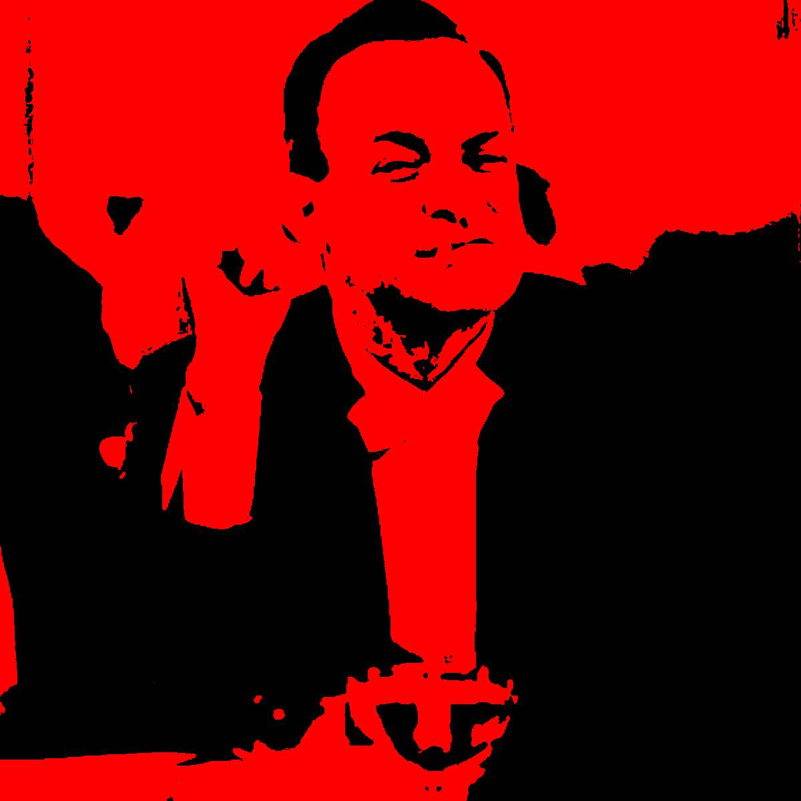
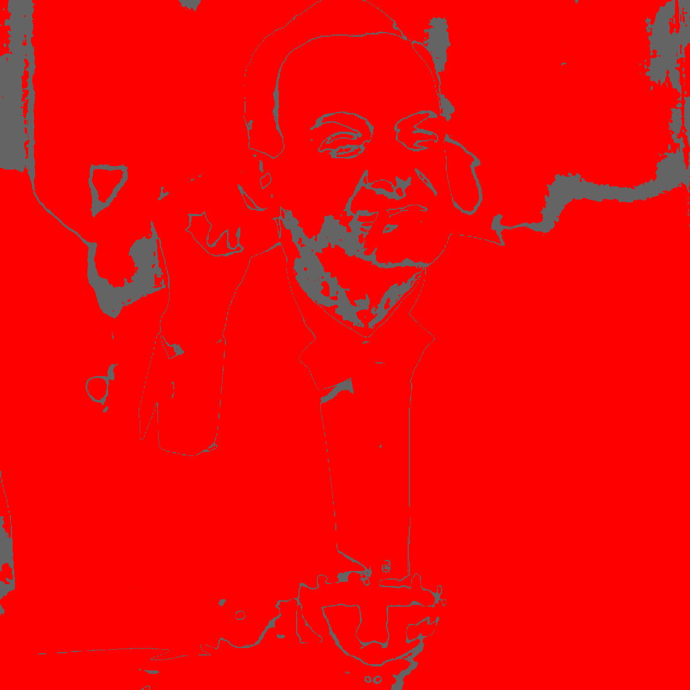
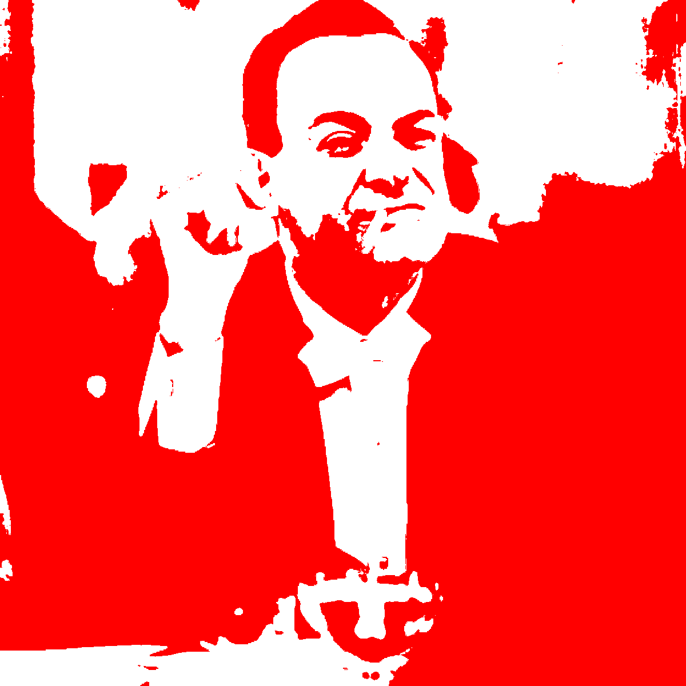

# Stencil Generator
python3 program that coverts an image file into 3 stencils, by cranking up the contrast and isolating different tones.


<p float="middle">
  
  
    
</p>

Input Image            |  Stencil Version
:-------------------------:|:-------------------------:
  |  

## usage

```py

make_stencils(image_name="test_image.jpg",contrast_factor=5,hi_lim=200,lo_lim=10)
```

<p float="middle">
  
  
  
</p>